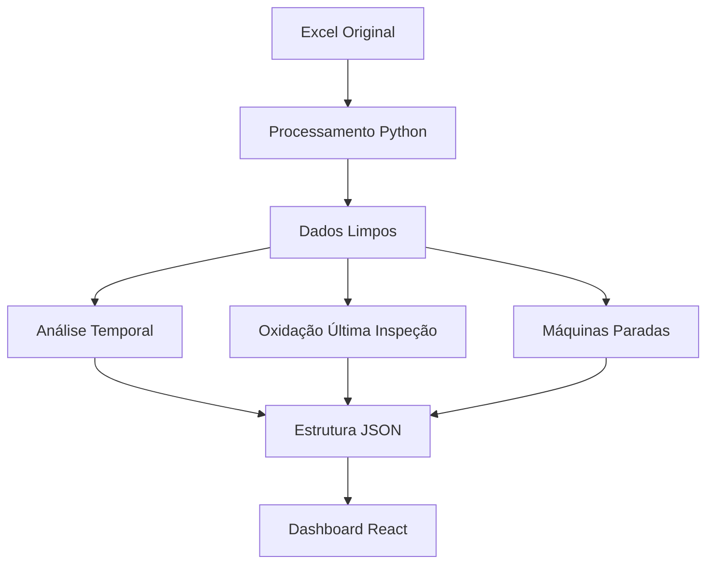

# 📊 Dashboard de Análise de Ímãs Eólicos

Dashboard interativo para análise e monitoramento de oxidação e troca de ímãs em turbinas eólicas.

## 🚀 Funcionalidades

### 📈 Análises Principais
- **Evolução Temporal das Oxidações**: Tendência mensal dos níveis de oxidação
- **Comparação entre Ciclos**: Distribuição de oxidação por ciclo de inspeção
- **Oxidação da Última Inspeção**: Estado atual baseado na última inspeção de cada turbina
- **Máquinas Paradas**: Análise de downtime por ciclo
- **Criticidade por Turbina**: Classificação de risco baseada em histórico

### 🔬 Métricas de Oxidação
- **Oxidação Baixa**: Indicadores de desgaste inicial
- **Oxidação Média**: Desgaste moderado requerendo atenção
- **Oxidação Alta**: Condição crítica necessitando intervenção
- **Troca de Spindle**: Casos especiais de manutenção

## 🛠️ Tecnologias Utilizadas

- **Python 3.8+**
- **Pandas**: Processamento e análise de dados
- **Plotly**: Gráficos interativos
- **React**: Interface do usuário
- **JSON**: Estrutura de dados para frontend

## 📋 Estrutura do Projeto

```
dashboard-imas-eolicos/
├── src/
│   ├── assets/
│   │   ├── dashboard_data.json          # Dados processados
│   │   └── maquinas_paradas.json        # Dados de paradas
│   ├── components/
│   │   ├── charts/                      # Componentes de gráficos
│   │   ├── tables/                      # Componentes de tabelas
│   │   └── metrics/                     # Componentes de métricas
│   └── App.jsx                          # Componente principal
├── data_processing/
│   └── processamento_dados.py           # Script de processamento
├── docs/
│   └── README.md                        # Documentação
└── requirements.txt                     # Dependências Python
```

## ⚙️ Instalação e Configuração

### Pré-requisitos
- Python 3.8 ou superior
- Node.js 16+ (para o frontend)
- Arquivo Excel com dados de inspeção

### 1. Configuração do Backend

```bash
# Clone o repositório
git clone https://github.com/deivid0304/dashboard-imas-eolicos.git
cd dashboard-imas-eolicos

# Instale as dependências Python
pip install -r requirements.txt
```

### 2. Processamento de Dados

```python
# Configure o caminho do arquivo Excel no script
arquivo_excel = "Analise de Imas trocados.xlsx"

# Execute o processamento
python data_processing/processamento_dados.py
```

### 3. Configuração do Frontend

```bash
# Instale as dependências do React
npm install

# Execute o servidor de desenvolvimento
npm start
```

## 📊 Estrutura de Dados

### Fontes de Dados
- **Dados_Brutos**: Inspeções completas com DOWNWIND/UPWIND
- **Carreiras_Vertical**: Dados específicos por carreira

### Colunas Principais
```python
{
    "Data_inspecao": "Data da inspeção",
    "Turbina": "Identificação da turbina", 
    "Qtd_Imas_trocados": "Quantidade de ímãs trocados",
    "Ciclo_inspecao": "Ciclo de inspeção (Primeiro, Segundo, etc)",
    "DOWNWIND": "Estado do lado downwind",
    "UPWIND": "Estado do lado upwind",
    "Status": "Status da turbina",
    "Dias_parada": "Dias em parada"
}
```

## 🔍 Classificação de Oxidação

### Lógica de Classificação
```python
def classificar_oxidacao(downwind, upwind):
    """
    Classifica o nível de oxidação baseado em DOWNWIND e UPWIND
    Retorna: 'baixa', 'media', 'alta', 'troca_spindle', 'sem_oxidacao'
    """
```

### Critérios
- **Alta**: Presença de "ALTO" em qualquer lado
- **Média**: Presença de "MÉDIO" em qualquer lado  
- **Baixa**: Presença de "BAIXO" em qualquer lado
- **Troca Spindle**: Menção específica à troca de spindle

## 📈 Métricas Calculadas

### Totais Gerais
- Total de ímãs trocados
- Total de turbinas únicas
- Total de oxidações registradas
- Total de máquinas paradas

### Por Ciclo
- Distribuição de oxidação (Baixa/Média/Alta)
- Percentuais por nível de criticidade
- Dias médios de parada
- Ímãs trocados por ciclo

### Temporais
- Evolução mensal da oxidação
- Tendências por ciclo
- Sazonalidade de manutenções

## 🎯 Gráficos e Visualizações

### 1. Evolução Temporal das Oxidações
- **Tipo**: Gráfico de linha
- **Dados**: `oxidacao_temporal.temporal_por_mes`
- **Eixo X**: Meses/Anos
- **Eixo Y**: Quantidade de oxidações
- **Séries**: Baixa, Média, Alta por ciclo

### 2. Comparação de Oxidações entre Ciclos  
- **Tipo**: Gráfico de barras
- **Dados**: `oxidacao_temporal.variacao_entre_ciclos`
- **Categorias**: Ciclos de inspeção
- **Métricas**: Distribuição percentual por nível

### 3. Métricas de Estado Atual
- **Tipo**: Cards/KPIs
- **Dados**: `resumo` (oxidação da última inspeção)
- **Foco**: Situação atual do parque eólico

## 🔄 Fluxo de Processamento



## 📝 Exemplo de Uso

### Processamento de Dados
```python
# O script detecta automaticamente as colunas
df_clean = preparar_dataframe_principal(df)

# Executa análises temporais
oxidacao_temporal_df, variacao_ciclos_df = analise_evolucao_temporal(df_clean)

# Calcula estado atual
oxidacao_atual = calcular_oxidacao_ultima_inspecao(df_clean)
```

### Estrutura de Saída JSON
```json
{
  "oxidacao_temporal": {
    "temporal_por_mes": [...],
    "variacao_entre_ciclos": [...]
  },
  "resumo": {
    "total_imas_trocados": 1500,
    "total_oxidacao_baixa": 45,
    "total_oxidacao_media": 23,
    "total_oxidacao_alta": 12
  }
}
```

## 🐛 Solução de Problemas

### Problemas Comuns

1. **Colunas não encontradas**
   - Verifique os nomes das colunas no Excel
   - Use a função `encontrar_coluna` para debug

2. **Dados temporais inconsistentes**
   - Verifique formatos de data
   - Use `pd.to_datetime` com `errors='coerce'`

3. **Classificação de oxidação**
   - Revise os critérios na função `classificar_oxidacao`
   - Verifique valores em DOWNWIND/UPWIND

### Logs e Debug
```python
# Ative logs detalhados
print(f"📊 Processando: {len(df_clean)} registros")
print(f"🔍 Colunas detectadas: {list(df_clean.columns)}")
```

## 🤝 Contribuição

1. Fork o projeto
2. Crie uma branch para sua feature (`git checkout -b feature/AmazingFeature`)
3. Commit suas mudanças (`git commit -m 'Add some AmazingFeature'`)
4. Push para a branch (`git push origin feature/AmazingFeature`)
5. Abra um Pull Request

## 📄 Licença

Distribuído sob a licença MIT. Veja `LICENSE` para mais informações.

## 👥 Autores

- **Deivid Marcio** - *Desenvolvimento inicial* - [deivid0304](https://github.com/deivid0304)

## 🙏 Agradecimentos

- Equipe de operações e manutenção
- Time de análise de dados
- Contribuidores do projeto

---

**⭐️ Se este projeto foi útil, considere dar uma estrela no repositório!**
